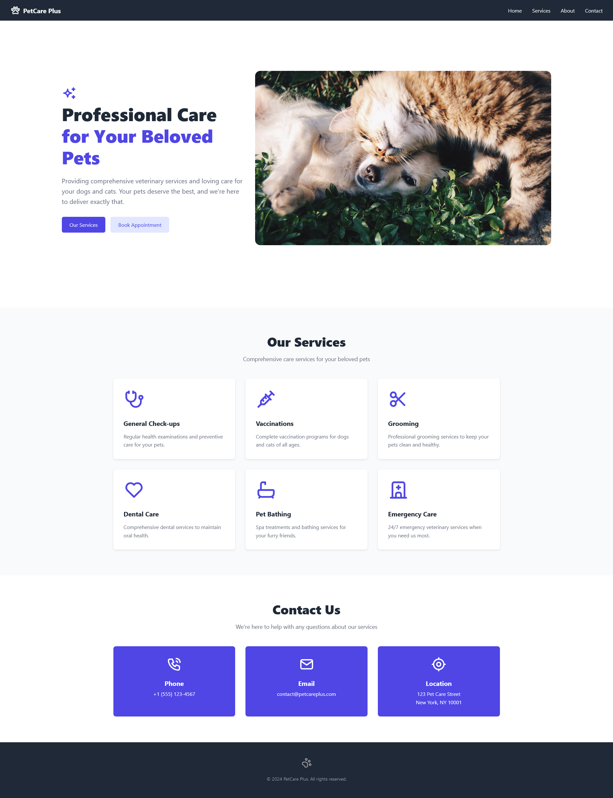
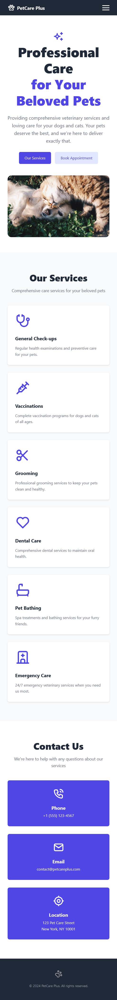

# Pet Care Website 🐾

A responsive and interactive website for pet care services, designed using HTML, CSS, and JavaScript. This project aims to provide an engaging and informative experience for pet owners looking for top-notch care for their furry friends.

---

## Table of Contents

- [Live Preview](#live-preview)
- [Features](#features)
- [Technologies Used](#technologies-used)
- [Screenshots](#screenshots)
- [Contributing](#contributing)
- [License](#license)

---

## Live Preview

👉 Check out the live version of the website here: [Pet Care Website Live](https://earnest-profiterole-a32238.netlify.app)

---

## Features

- **Responsive Design**: Adapts seamlessly to both desktop and mobile devices.
- **Interactive Elements**: JavaScript-powered dynamic features enhance user engagement.
- **Service Showcase**: A dedicated "Our Services" section highlighting all the care options.
- **Modern Styling**: A visually appealing layout created with CSS.

---

## Technologies Used

- **HTML**: Structured the website content.
- **CSS**: Styled the layout and components.
- **JavaScript**: Added interactivity and dynamic behavior.

---

## Screenshots

### Home Page

### Mobile Design

